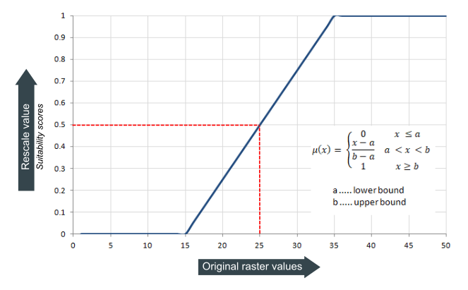
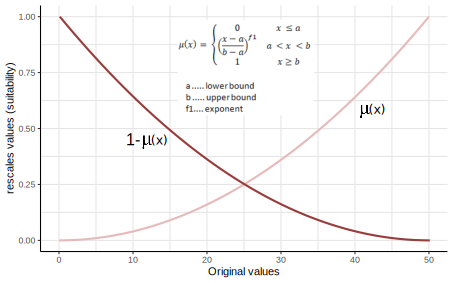
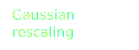

```{r global, include=FALSE}
# load data in 'global' chunk so it can be shared by all users of the dashboard
if (!require(shiny)) {
  install.packages("shiny")
}
if (!require(ggplot2)) {
  install.packages("ggplot2")
}
if (!require(plotly)) {
  install.packages("plotly")
}
if (!require(terra)) {
  install.packages("terra")
}
if (!require(tidyterra)) {
  install.packages("tidyterra")
}
library(shiny)
library(ggplot2)
library(tidyterra)
library(terra)

knitr::opts_chunk$set(cache = F)
```

```{r functions, include=FALSE}
# Load rescale functions
source("fuzzy_functions.r")
```

Dashboard {data-icon="fa-chart-line"}
=====================================  

Column {data-width=4 .tabset .tabset-fade}
-------------------------------------

### Inputs 

:::{.reduce_space}
:::{.textbox}

```{r}
# shiny inputs defined here
tags$p(tags$b("Raster values"))
fluidRow(
  column(6, numericInput("range_min", "Minimum:", min = NA, max = NA, value = 0)),
  column(6, numericInput("range_max", "Maximum:", min = NA, max = NA, value = 50))
)
```
:::

```{r}
tags$div(class="textbox",tags$p(tags$b("Rescale function")),
selectInput(
  "rescale_type",
  "Select function:",
  choices = c("Linear", "Gaussian", "Power",
              "Small", "Large", "Near"),
  selected = "Linear"
),
fluidRow(
  column(6, numericInput("target_min", "Target range min:", min = NA, max = NA, value = 0)),
  column(6, numericInput("target_max", "Target range max:", min = NA, max = NA, value = 1))
),
conditionalPanel(
  condition = "input.rescale_type == 'Linear'", 
  fluidRow(
    column(6,numericInput("linear_lb", "Lower bound:", min = NA, max = NA, value = 0)),
    column(6, numericInput("linear_ub", "Upper bound:", min = NA, max = NA, value = 50))
  )
),
conditionalPanel(
  condition = "input.rescale_type == 'Power'", 
  fluidRow(
    column(6, numericInput("power_lb", "Lower bound:", min = NA, max = NA, value = 0)),
    column(6, numericInput("power_ub", "Upper bound:", min = NA, max = NA, value = 50))),
  numericInput("power_f1", "Exponent:", min = 0, max = NA, value = 2),
),
conditionalPanel(
  condition = "input.rescale_type == 'Gaussian'",
  fluidRow(
    column(6, numericInput("gaus_f2",  "Midpoint:", min = NA, max = NA, value = 25)),
    column(6, numericInput("gaus_f1","Spread:", min = 0, max = NA, value = 0.01, step=0.01))
  )
),
conditionalPanel(
  condition = "input.rescale_type == 'Small' || 
               input.rescale_type == 'Large'",
  fluidRow(
    column(6, numericInput("mem_f1", "Spread:", min = NA, max = NA, value = 4)),
    column(6, numericInput("mem_f2", "Midpoint:", min = NA, max = NA, value = 20))
  )
),
conditionalPanel(
  condition = "input.rescale_type == 'Near'",
  fluidRow(
    column(6, numericInput("near_f2", "Midpoint:", min = NA, max = NA, value = 25)),
    column(6, numericInput("near_f1", "Spread:", min = 0, max = NA, value = 0.06, step=0.01))
    )
  )
)

```

```{r}
conditionalPanel(
  condition = "input.compareplots == true",
  tags$div(class="textbox",tags$p(tags$b("Rescale function")),
  selectInput(
    "rescale_type2",
    "Selection function:",
    choices = c("Linear", "Gaussian", "Power",
                "Small", "Large", "Near"),
    selected = "Power"
  ),
  fluidRow(
    column(6, numericInput("target_min2", "target range min:", min = NA, max = NA, value = 0)),
    column(6,numericInput("target_max2", "Target range max:", min = NA, max = NA, value = 1))
  ),
  conditionalPanel(
    condition = "input.rescale_type2 == 'Linear'", 
      fluidRow(
        column(6,numericInput("linear_lb2", "Lower bound:", min = NA, max = NA, value = 0)),
        column(6, numericInput("linear_ub2", "Upper bound:", min = NA, max = NA, value = 50))
      )
    ),
    conditionalPanel(
      condition = "input.rescale_type2 == 'Power'", 
      fluidRow(
        column(6, numericInput("power_lb2", "Lower bound:", min = NA, max = NA, value = 0)),
        column(6, numericInput("power_ub2", "Upper bound:", min = NA, max = NA, value = 50))),
      numericInput("power_f12", "Exponent:", min = 0, max = NA, value = 2),
    ),
    conditionalPanel(
      condition = "input.rescale_type2 == 'Gaussian'",
      fluidRow(
        column(6, numericInput("gaus_f22",  "Midpoint:", min = NA, max = NA, value = 25)),
        column(6, numericInput("gaus_f12","Spread:", min = 0, max = NA, value = 0.01, step=0.01))
      )
    ),
    conditionalPanel(
      condition = "input.rescale_type2 == 'Small' || 
                         input.rescale_type2 == 'Large'",
      fluidRow(
        column(6, numericInput("mem_f12", "Spread:", min = NA, max = NA, value = 4)),
        column(6, numericInput("mem_f22", "Midpoint:", min = NA, max = NA, value = 15))
      )
    ),
    conditionalPanel(
      condition = "input.rescale_type2 == 'Near'",
      fluidRow(
        column(6, numericInput("near_f22", "Midpoint:", min = NA, max = NA, value = 25)),
        column(6, numericInput("near_f12", "Spread:", min = 0, max = NA, value = 0.06, step=0.01))
      )
    )
  )
)
```

```{r}
fluidRow(
  column(6, checkboxInput("compareplots", "Compare plots", FALSE)),
  column(6, checkboxInput("scale01", "Constraint y-axis to 0-1", FALSE)),
  style='height:1.8rem'
)
```
:::

### Intro 
:::{.textbox}
In most GIS programs you can rescale raster values using the raster calculator. But QGIS, GRASS GIS and SAGA GIS, among others, offer convenient functions that do the hard work for you. In QGIS, go to the processing toolbox and look for the [fuzzify](https://docs.qgis.org/testing/en/docs/user_manual/processing_algs/qgis/rasteranalysis.html#fuzzify-raster-gaussian-membership) functions. In GRASS GIS, check out the [r.fuzzy.set](https://grass.osgeo.org/grass-stable/manuals/addons/r.fuzzy.set.html) add-on. And for SAGA GIS, look for the _fuzzify_ function in the Grid | Calculus submenu.

> Note that fuzzify and rescale functions, while conceptually different, can be considered similar in terms of their underlying mathematical operations. Both functions involve applying mathematical formulas to adjust and map values onto a desired range. For that reason, we can use the before-mentioned fuzzify functions to rescale our layers.

The problem, especially if you are not familiar with the different rescaling functions, is to decide which parameter settings to use.

This app aims to provide a visual aid by allowing you to try out the different rescaling functions and their parameter settings. You can also compare two different combinations of functions and settings. For now, the fuzzy functions from QGIS are implemented.

For more information about the available rescaling functions, see the Information tab. For the source code on Github click [here](https://github.com/ecodiv/shiny_rescale_by_function/).
:::

:::{.textbox}

Try out a rescale function, change the parameters and you'll see the result (almost) immediately. Select the _compare plots_ to compare different rescaling functions or different parameter settings. 

If you change the minimum and maximum target range, you have the option to constrain the x-axis to a scale from 0-1.

Hoover over the plots to get the value at a specific point in your graph. It will also show a button (camera) that you can use to save the image to your computer.

:::

Column {data-width=5}
-------------------------------------

```{r}
# Create demo raster layers
n=50
r <- reactive(rast(ncol=n, nrow=n,  crs="epsg:28992", extent=c(0,n, 0, n),
                   vals=seq(as.numeric(range_min()), 
                            as.numeric(range_max()), 
                            length.out=n)))
s <- rast(ncol=n, nrow=n, crs="epsg:28992", extent=c(0,n, 0, n), vals=NA)
# Plot parameters
Noax <- list(
  title = "",
  zeroline = FALSE,
  showline = FALSE,
  showticklabels = FALSE,
  showgrid = FALSE,
  fixedrange = TRUE
)
configbut <- c("zoomIn2d", "zoomOut2d", "pan2d", "select2d", "lasso2d",
               "hoverCompareCartesian", "hoverClosestCartesian")
# minmaxr <- terra::minmax(r, compute=TRUE)
```
    
### Graph

```{r}
# Get input
range_min <- reactive(input$range_min)
range_max <- reactive(input$range_max)
target_min <- reactive(input$target_min)
target_max <- reactive(input$target_max)
rescale_type <- reactive(input$rescale_type)
linear_lb <- reactive(input$linear_lb)
linear_ub <- reactive(input$linear_ub)
gaus_f1 <- reactive(input$gaus_f1)
gaus_f2 <- reactive(input$gaus_f2)
power_lb <- reactive(input$power_lb)
power_ub <- reactive(input$power_ub)
power_f1 <- reactive(input$power_f1)
mem_f1 <- reactive(input$mem_f1)
mem_f2 <- reactive(input$mem_f2)
near_f1 <- reactive(input$near_f1)
near_f2 <- reactive(input$near_f2)
scale01 <- reactive(input$scale01)
tarmin <- reactive(ifelse(scale01(), 0, target_min()))
tarmax <- reactive(ifelse(scale01(), 1, target_max()))
compareplots <- reactive(input$compareplots)
target_min2 <- reactive(input$target_min2)
target_max2 <- reactive(input$target_max2)
rescale_type2 <- reactive(input$rescale_type2)
linear_lb2 <- reactive(input$linear_lb2)
linear_ub2 <- reactive(input$linear_ub2)
gaus_f12 <- reactive(input$gaus_f12)
gaus_f22 <- reactive(input$gaus_f22)
power_lb2 <- reactive(input$power_lb2)
power_ub2 <- reactive(input$power_ub2)
power_f12 <- reactive(input$power_f12)
mem_f12 <- reactive(input$mem_f12)
mem_f22 <- reactive(input$mem_f22)
near_f12 <- reactive(input$near_f12)
near_f22 <- reactive(input$near_f22)


# Generate data
x <- reactive(seq(range_min(), range_max(), length.out = 1000))
# Data for plot 1
df1 <-  reactive({
  if(as.character(rescale_type()) == "Linear"){
      df <- data.frame(
        x = x(),
        y = linear_rescale(x(), range_min(), range_max(), linear_lb(), linear_ub(),
                          target_min(), target_max()),
          Plots = "plot1"
        )
    } else if (as.character(rescale_type()) == "Gaussian") {
      df <-
        data.frame(
        x = x(),
        y = gaussian_rescale(x(), gaus_f1(), gaus_f2(), 
                             target_min(), target_max()),
          Plots = "plot1"
        )
    } else if (as.character(rescale_type()) == "Power") {
      df <-
        data.frame(
        x = x(),
        y = power_rescale(x(), power_lb(), power_ub(), power_f1(), 
                          target_min(), target_max()),
          Plots = "plot1"
        )
    } else if (as.character(rescale_type()) == "Large") {
      df <- 
        data.frame(
        x = x(),
        y = large_rescale(x(), mem_f1(), mem_f2(), 
                          target_min(), target_max()),
          Plots = "plot1"
        )
    } else if (as.character(rescale_type()) == "Small") {
      df <-
        data.frame(
        x = x(),
        y = small_rescale(x(), mem_f1(), mem_f2(), 
                          target_min(), target_max()),
          Plots = "plot1"
        )
    } else if (as.character(rescale_type()) == "Near") {
      df <- 
        data.frame(
        x = x(),
        y = near_rescale(x(), near_f1(), near_f2(), 
                         target_min(), target_max()),
          Plots = "plot1"
        )
    }
})

df <-  reactive({
  if(compareplots()){
    if(as.character(rescale_type2()) == "Linear"){
        df2 <- data.frame(
          x = x(),
          y = linear_rescale(x(), range_min(), range_max(), linear_lb2(), linear_ub2(),
                            target_min2(), target_max2()),
          Plots = "plot2"
          )
      } else if (as.character(rescale_type2()) == "Gaussian") {
        df2 <-
          data.frame(
          x = x(),
          y = gaussian_rescale(x(), gaus_f12(), gaus_f22(),
                               target_min2(), target_max2()),
          Plots = "plot2"
          )
      } else if (as.character(rescale_type2()) == "Power") {
        df2 <-
          data.frame(
          x = x(),
          y = power_rescale(x(), power_lb2(), power_ub2(), power_f12(),
                            target_min2(), target_max2()),
          Plots = "plot2"
          )
      } else if (as.character(rescale_type2()) == "Large") {
        df2 <-
          data.frame(
          x = x(),
          y = large_rescale(x(), mem_f12(), mem_f22(),
                            target_min2(), target_max2()),
          Plots = "plot2"
          )
      } else if (as.character(rescale_type2()) == "Small") {
        df2 <-
          data.frame(
          x = x(),
          y = small_rescale(x(), mem_f12(), mem_f22(),
                            target_min2(), target_max2()),
          Plots = "plot2"
          )
      } else if (as.character(rescale_type2()) == "Near") {
        df2 <-
          data.frame(
          x = x(),
          y = near_rescale(x(), near_f12(), near_f22(),
                           target_min2(), target_max2()),
          Plots = "plot2"
          )
      }
    df <- rbind(df1(), df2)
  }else{
    df <- df1()
    }
  })

renderPlotly({
  plotly::ggplotly(
    ggplot(df(), aes(x, y, color=Plots)) +
      geom_line(linewidth=1.0) +
      theme_bw() +
      theme(legend.position="none") +
      ylim(tarmin(), tarmax()) +
      xlim(range_min(), range_max()) +
      labs(x = "Original data values", y = "Rescaled data values") +
      scale_color_manual(values = c("plot1" = "#008AFF", "plot2" = "#309464"))
  ) |>
    config(displaylogo = FALSE)
})
```

### <span class="dot1"></span> [Rescaled layer]{.first-rescale}
    
```{r}
renderPlotly({
  if(as.character(rescale_type()) == "Linear"){
    rescale_r <- reactive(linres(r(), s, linear_lb(), linear_ub(), 
                                 target_min(), target_max()))
  } else if (as.character(rescale_type()) == "Gaussian") {
    rescale_r <- reactive(gaures(r(), gaus_f1(), gaus_f2(), 
                                 target_min(), target_max()))
  } else if (as.character(rescale_type()) == "Power") {
    rescale_r <- reactive(powres(r(), s, power_lb(), power_ub(), 
                                 target_min(), target_max(), power_f1()))
  } else if (as.character(rescale_type()) == "Large") {
    rescale_r <- reactive(larres(r(), mem_f1(), mem_f2(), 
                                 target_min(), target_max()))
  } else if (as.character(rescale_type()) == "Small") {
    rescale_r <- reactive(smares(r(), mem_f1(), mem_f2(), 
                                 target_min(), target_max()))
  } else if (as.character(rescale_type()) == "Near") {
    rescale_r <- reactive(neares(r(), near_f1(), near_f2(), 
                                 target_min(), target_max()))
    } 
  p <- ggplot() +
    geom_spatraster(data=rescale_r()) +
    #geom_spatraster_contour(data = rescale_r, bins=10, colour="white", alpha=0.2) +
    scale_fill_viridis_c() +
    theme_void() +
    theme(legend.position = "bottom",
          legend.text=element_text(size=10),
          legend.key.width = unit(1, 'cm'))
  plotly::ggplotly(p, tooltip="value") |>
    layout(xaxis = Noax, yaxis = Noax) |>
    config(modeBarButtonsToRemove = configbut, displaylogo = FALSE)
  })
``` 

Column {data-width=5}
-------------------------------------
    
### Original layer
    
```{r}
renderPlotly({
  p <- ggplot() +
    geom_spatraster(data = r()) +
    #geom_spatraster_contour(data = rescale_r, bins=10, colour="white", alpha=0.2) +
    scale_fill_viridis_c() +
    theme_void() +
    theme(legend.position = "bottom",
          legend.text=element_text(size=10),
          legend.key.width = unit(1, 'cm'))
  plotly::ggplotly(p, tooltip="value") |>
    layout(xaxis = Noax, yaxis = Noax) |>
    config(modeBarButtonsToRemove = configbut, displaylogo = FALSE)
  })
```

### <span class="dot2"></span> [Rescaled layer]{.second-rescale}

```{r}
renderPlotly({
  if(compareplots()){
      if(as.character(rescale_type2()) == "Linear"){
        rescale_r2 <- reactive(linres(r(), s, linear_lb2(), linear_ub2(), 
                                     target_min2(), target_max2()))
      } else if (as.character(rescale_type2()) == "Gaussian") {
        rescale_r2 <- reactive(gaures(r(), gaus_f12(), gaus_f22(), 
                                     target_min2(), target_max2()))
      } else if (as.character(rescale_type2()) == "Power") {
        rescale_r2 <- reactive(powres(r(), s, power_lb2(), power_ub2(), 
                                     target_min2(), target_max2(), power_f12()))
      } else if (as.character(rescale_type2()) == "Large") {
        rescale_r2 <- reactive(larres(r(), mem_f12(), mem_f22(), 
                                     target_min2(), target_max2()))
      } else if (as.character(rescale_type2()) == "Small") {
        rescale_r2 <- reactive(smares(r(), mem_f12(), mem_f22(), 
                                     target_min2(), target_max2()))
      } else if (as.character(rescale_type2()) == "Near") {
        rescale_r2 <- reactive(neares(r(), near_f12(), near_f22(), 
                                     target_min2(), target_max2()))
      }
    p <- ggplot() +
      geom_spatraster(data=rescale_r2()) +
      #geom_spatraster_contour(data = rescale_r, bins=10, colour="white", alpha=0.2) +
      scale_fill_viridis_c() +
      theme_void() +
      theme(legend.position = "bottom",
            legend.text=element_text(size=10),
            legend.key.width = unit(1, 'cm'))
    plotly::ggplotly(p, tooltip="value") |>
      layout(xaxis = Noax, yaxis = Noax) |>
      config(modeBarButtonsToRemove = configbut, displaylogo = FALSE)
  }
})
```

Information {.storyboard data-icon="fa-circle-info"}
=====================================     

### 

::: {.slide_frame}

#### Rescale using a linear transformation

<div class="paddingimage">
```{r, out.width= "60%", out.extra='style="float:right;"'}

```
</div>

When the preference or suitability increase or decrease at a constant rate, a linear transformation is used to rescale values between a given minimum and maximum value onto a suitability scale between 0 and 1.

One can define a positive or negative linear transformation. To accomplish the latter, swap the lower and upper bound values. 

In the graph shown here, minimum and maximum original values are set to 0 and 50 respectively. Furthermore, the lower bound is set to 15 and the upper bound to 35. I.e., all values equal or larger then 35 will be rescaled to a value 1. And all values smaller then 15 are rescaled to a value of 0.  

:::

***

::: {.slide_frame}

#### User case

A company needs to evaluate potential store locations based on criteria like population density, average income, competition, and transportation accessibility. They want to use a multicriteria decision analysis (MCDA) but face the challenge of different measurement scales for each criterion.

To compare and rank potential locations fairly, the company decides to apply a linear rescale function to transform criteria onto a common scale. The use the linear function to preserve the relative differences between the values while standardizing the scale.

:::

### 

::: {.slide_frame_tide}

#### Rescale using a power transformation

The Fuzzify raster (power membership) algorithm rescales the values of an input raster onto a scale between 0 and 1 following a power transformation function. If used for suitability analysis, the 0 would imply not suitable and 1 suitable conditions. 

<div class="paddingimage">
```{r lkajdfs, out.width= "60%", out.extra='style="float:right;"'}

```
</div>

The power function is constructed using three user-defined input raster values which set the point of fully suitable conditions (upper bound, results to 1), unsuitable conditions (low bound, results to 0) and the function exponent (only positive). The in between the upper and lower bounds values is defined as a power function. Both increasing and decreasing fuzzy sets can be modeled by swapping the high and low bound parameters.

In a suitability model, the power function can be used when the lowest input values are the least preferable, and as the input values increase, the suitability scores increase. Depending on the settings, the scores are increasing faster (when using a power exponent > 1) or slower (when using a power exponent < 1) with increasing input values. This is illustrated in the second figure, were power exponents of 0.2 and 2 are used. The  lower and upper bound are set to the minimum and maximum of the input data (0 and 50). 

In the third figure, the same same power exponents of 0.2 and 2 are used. But this time, the lower bound is defined as 15, and the upper bound as 30. 

:::

***

::: {.slide_frame_tide}

#### User case

A conservation biologist assesses the suitability of different areas for a particular species based on the availability of food resources. The assumption is that if food availability is low, a small increase will have a large effect. However, the effect of more food on suitability levels off at higher values. In other words, the more food there is, the less effect a further increase will have on suitability. At a certain threshold, more food will have no further effect on suitability as other constraints become more important.

```{r, out.width= "100%"}
knitr::include_graphics("images/rescale_powermembership.svg")
```

A power transformation with a power exponent < 1 and an upper bound representing the threshold beyond which a further increase in food availability has no further effect can capture this behaviour.

:::

### 

```{r}
```
test

### 

```{r}
```
test

### 

```{r}
```
test

### 

```{r}
```
test


